# Proyecto FitnessApp

## Tecnologias :

```
→ React Native
→ Expo Go
→ Emulador opcional (Nox) o Dispositivo Android o IOS
→ Diseño UX/UI : Figma
```

## Descripción
Este es un proyecto de una aplicación de fitness que permite a los usuarios llevar un seguimiento de sus entrenamientos, metas y progreso. La interfaz está diseñada para ser simple, funcional y accesible para todos los usuarios.

## Interfaz Principal
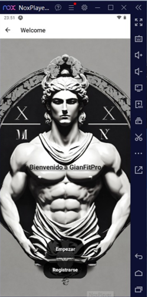  
La pantalla de inicio de la aplicación muestra un resumen general del progreso y las opciones para navegar por las diferentes secciones de la app.

## Interfaz Login
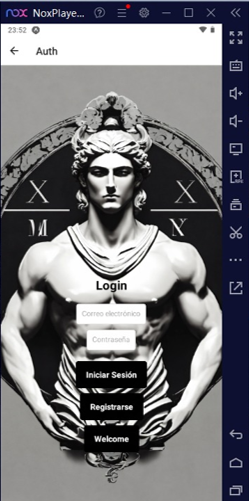  
La pantalla de login permite a los usuarios autenticarse para acceder a su cuenta y personalizar su experiencia dentro de la app.

## Interfaz Login - Registro
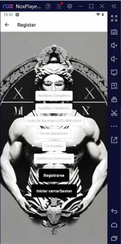  
Pantalla donde los nuevos usuarios pueden registrarse proporcionando sus datos, creando una cuenta en la aplicación para empezar a utilizarla.


## Interfaz de Home
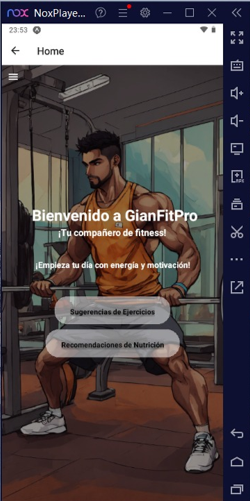  
La pantalla de "Home" proporciona una visión general rápida del estado de la aplicación, accesos directos a las funciones más utilizadas y un resumen del progreso del usuario.


## Menú
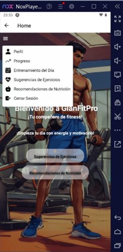  
El menú de navegación permite al usuario acceder a diferentes secciones de la aplicación, como el perfil, entrenamientos, y configuración de la cuenta.


## Interfaz de Perfil
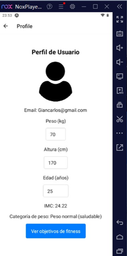  
En la pantalla de perfil, los usuarios pueden ver y editar su información personal, como su foto, nombre y preferencias de entrenamiento.

## Progreso del Usuario
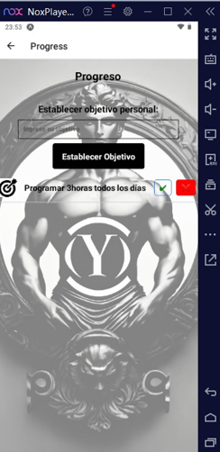  
Pantalla que muestra el progreso general del usuario, con gráficos y métricas relacionadas con los entrenamientos realizados y los resultados alcanzados.


## Interfaz de Entrenamiento Semanal
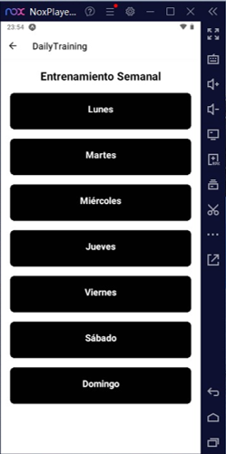  
Esta pantalla muestra el plan de entrenamiento semanal del usuario, donde puede ver qué ejercicios están programados para cada día.

## Sugerencia de Ejercicios
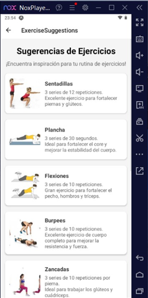  
Esta pantalla sugiere ejercicios personalizados para el usuario basados en su progreso y preferencias.


## Recomendaciones de Nutrición
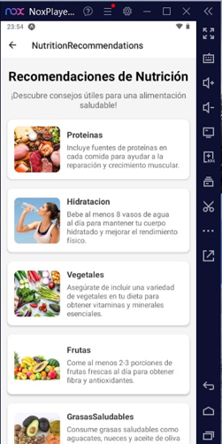  
La aplicación ofrece recomendaciones de nutrición basadas en los objetivos y la actividad física del usuario, ayudándole a llevar un estilo de vida saludable.


## Interfaz de Objetivos
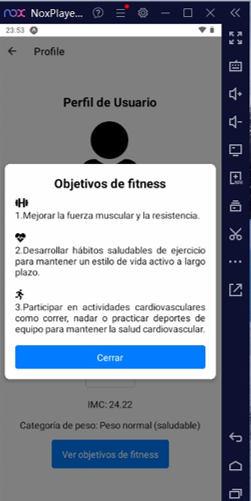  
Los usuarios pueden establecer sus objetivos de fitness, como pérdida de peso, aumento de masa muscular, o mejorar la resistencia. Aquí pueden ver su progreso en relación con dichos objetivos.


